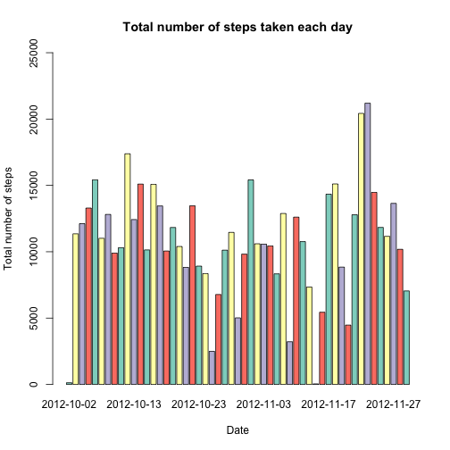
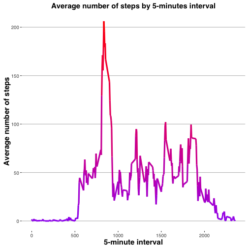
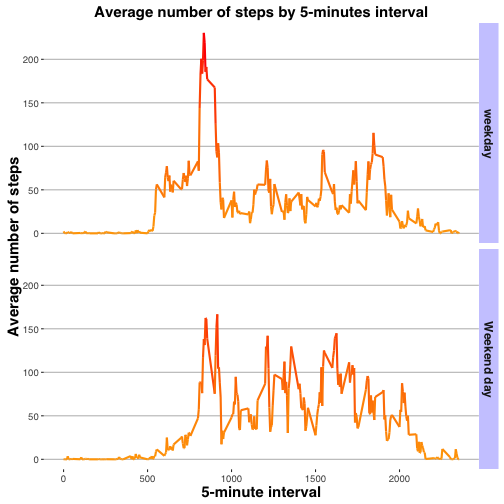

REPRODUCIBLE RESEARCH : Project 1
========================================

# Loading and reprocessing the data

Load the data

```r
FILE <- "repdata%2Fdata%2Factivity.zip"
fileURL <- "https://d396qusza40orc.cloudfront.net/repdata%2Fdata%2Factivity.zip"
download.file(fileURL, destfile="./repdata%2Fdata%2Factivity.zip", method="curl")
unzip ("./repdata%2Fdata%2Factivity.zip")
REP_DATA_ACTIVITY <- read.table ("activity.csv", header=TRUE, sep=",")
```
                  
change the dates

```r
REP_DATA_ACTIVITY$date <- as.Date(REP_DATA_ACTIVITY$date, "%Y-%m-%d")
```

# What is mean total number of steps taken per day?

Calculare the total number of steps taken per day


```r
aggregated_date <- aggregate (steps ~ date, REP_DATA_ACTIVITY, sum)  
```

Make a histogram of the total number of steps taken each day


```r
library(RColorBrewer)
barplot (aggregated_date$steps, names.arg=aggregated_date$date, ylim=c (0,25000),
         col=brewer.pal(4,"Set3"), main="Total number of steps taken each day", ylab="Total number of steps",
         xlab="Date")
```

 

Calculate and report the mean and median of the total number of steps taken per day


```r
library(prettyR)
mean (aggregated_date$steps , na.rm=T)
```

```
## [1] 10766.19
```

```r
median (aggregated_date$steps , na.rm=T)
```

```
## [1] 10765
```

# What is the average daily activity pattern?

Make a time series plot (i.e. 𝚝𝚢𝚙𝚎 = "𝚕") of the 5-minute interval (x-axis) and the average number of steps taken, averaged across all days (y-axis)


```r
library (ggplot2)
library (ggthemes)
aggregated_data2 <- aggregate (x=list (steps=REP_DATA_ACTIVITY$steps),
                              by=list(interval=REP_DATA_ACTIVITY$interval), 
                              FUN=mean, na.rm=TRUE)
PLOT_timeseries <- ggplot (aggregated_data2, aes (interval, steps))
PLOT_timeseries + geom_line(aes(colour=aggregated_data2$steps),size=1.5) + theme_hc()  + xlab ("5-minute interval") + ylab ("Average number of steps") + 
  ggtitle ("Average number of steps by 5-minutes interval") +
  theme(axis.title.x = element_text(color="black", size=15, face= "bold"),
        axis.title.y = element_text(color="black", size=15, face= "bold"),
        plot.title= element_text(color="black", size=15, face="bold"),
        legend.position="none") +
  scale_colour_gradient(low="purple", high="red") 
```

 

Which 5-minute interval, on average across all the days in the dataset, contains the maximum number of steps?

```r
aggregated_data2$interval[which.max(aggregated_data2$steps)]
```

```
## [1] 835
```

# Imputing missing values

Calculate and report the total number of missing values in the dataset (i.e. the total number of rows with 𝙽𝙰s)

```r
sum (is.na (REP_DATA_ACTIVITY$steps))
```

```
## [1] 2304
```

Devise a strategy for filling in all of the missing values in the dataset. The strategy does not need to be sophisticated. For example, you could use the mean/median for that day, or the mean for that 5-minute interval, etc.


```r
new_REP_DATA_ACTIVITY<- REP_DATA_ACTIVITY
missing_Na <- is.na(new_REP_DATA_ACTIVITY$steps)
new_REP_DATA_ACTIVITY$mean_int <- tapply (new_REP_DATA_ACTIVITY$steps, new_REP_DATA_ACTIVITY$interval, mean, na.rm=TRUE, simplify=TRUE)
new_REP_DATA_ACTIVITY$steps2 <- ifelse (missing_Na=="TRUE", new_REP_DATA_ACTIVITY$mean_int, new_REP_DATA_ACTIVITY$steps)
View (new_REP_DATA_ACTIVITY)
```

Create a new dataset that is equal to the original dataset but with the missing data filled in.

```r
library (gdata)
new_REP_DATA_ACTIVITY<- remove.vars (new_REP_DATA_ACTIVITY, "steps")
new_REP_DATA_ACTIVITY <- rename.vars (new_REP_DATA_ACTIVITY, "steps2", "steps")
```

Make a histogram of the total number of steps taken each day  


```r
aggregated_data2 <- aggregate (x=list (steps=new_REP_DATA_ACTIVITY$steps),
                              by=list(date=new_REP_DATA_ACTIVITY$date), 
                              FUN=sum, na.rm=TRUE)
barplot (aggregated_data2$steps, names.arg=aggregated_data2$date, ylim=c (0,25000),
         col=brewer.pal(4,"Set3"), main="Total number of steps taken each day", ylab="Total number of steps",
         xlab="Date")
```

 

Calculate and report the mean and median total number of steps taken per day

```r
mean (aggregated_data2$steps , na.rm=T)
```

```
## [1] 10766.19
```

```r
median (aggregated_data2$steps , na.rm=T)
```

```
## [1] 10766.19
```

Do these values differ from the estimates from the first part of the assignment? What is the impact of imputing missing data on the estimates of the total daily number of steps?

- No difference for he mean beacuse we used the mean but the median is higher

# Are there differences in activity patterns between weekdays and weekends?

Create a new factor variable in the dataset with two levels – “weekday” and “weekend” indicating whether a given date is a weekday or weekend day.


```r
new_REP_DATA_ACTIVITY$weekday <- weekdays (new_REP_DATA_ACTIVITY$date)
new_REP_DATA_ACTIVITY$weekend <- ifelse (new_REP_DATA_ACTIVITY$weekday=="Samedi" | new_REP_DATA_ACTIVITY$weekday=="Dimanche", "Weekend day" ,"weekday")
table (new_REP_DATA_ACTIVITY$weekday)
```

```
## 
## Dimanche    Jeudi    Lundi    Mardi Mercredi   Samedi Vendredi 
##     2304     2592     2592     2592     2592     2304     2592
```

```r
table (new_REP_DATA_ACTIVITY$weekend)
```

```
## 
##     weekday Weekend day 
##       12960        4608
```

Make a panel plot containing a time series plot (i.e. 𝚝𝚢𝚙𝚎 = "𝚕") of the 5-minute interval (x-axis) and the average number of steps taken, averaged across all weekday days or weekend days (y-axis). See the README file in the GitHub repository to see an example of what this plot should look like using simulated data.


```r
aggregated_data3 <- aggregate(x=list(steps=new_REP_DATA_ACTIVITY$steps),
                              by=list(interval=new_REP_DATA_ACTIVITY$interval, weekend=new_REP_DATA_ACTIVITY$weekend), 
                              FUN=mean, na.rm=TRUE)
PLOT_timeseries <- ggplot (aggregated_data3, aes (interval, steps))                              
PLOT_timeseries + geom_line(aes(colour=aggregated_data3$steps),size=1)  +
  facet_grid (weekend~.) +
  theme_hc()  + xlab ("5-minute interval") + ylab ("Average number of steps") + 
  ggtitle ("Average number of steps by 5-minutes interval") +
  theme(axis.title.x = element_text(color="black", size=15, face= "bold"),
        axis.title.y = element_text(color="black", size=15, face= "bold"),
        plot.title= element_text(color="black", size=15, face="bold"),
        legend.position="none",
        strip.text.x = element_text(size=8, angle=75),
        strip.text.y = element_text(size=12, face="bold"),
        strip.background = element_rect(colour="red", fill="#CCCCFF")) +
  scale_colour_gradient(low="orange", high="red")
```

 
